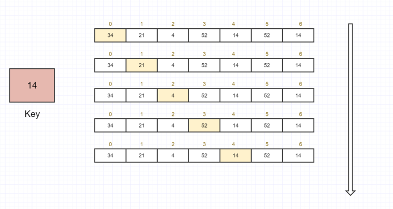
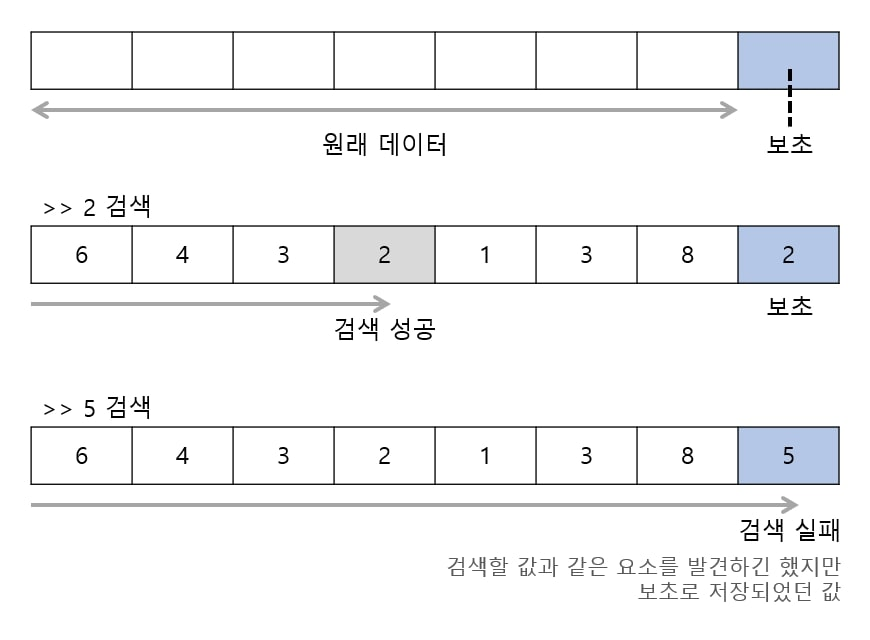
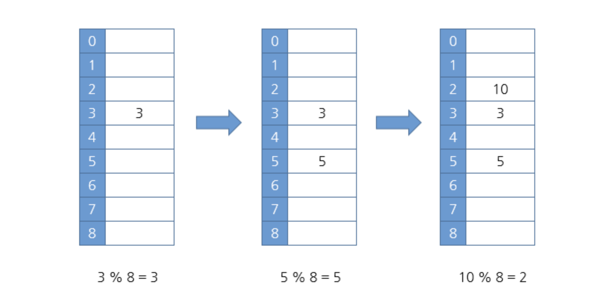
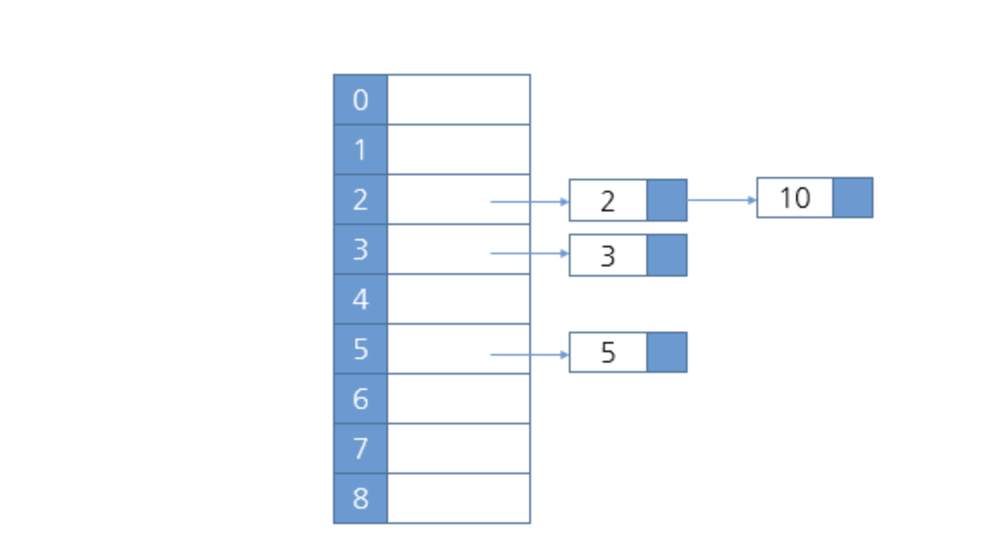
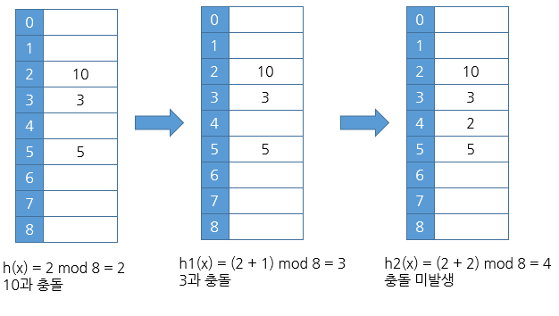

# Doit_Python_DS

## 검색 알고리즘
### 선형검색
직선 모양으로 늘어선 배열에서 검색하는 경우 원하는 키값을 가진 원소를 찾을때까지 검색

###  보초법 
선형 검색은 반복할 때마다 2가지 종료 조건 체크

이 비용을 2배로 줄이기 위한 방법 보초법

배열 맨 끝에 검색 키값을 저장하고 비교하면서 검색

### 해시법
데이터를 저장할 위치인 '인덱스'를 간단한 연산으로 구하는 것이다. 이렇게 구한 인덱스를 '해시값'이라고 한다. 마치 인덱스처럼 해시값을 통해서 데이터를 다룰 수 있게 된다. 

 
ㅡ 즉, 해시값은 데이터에 접근할 때 사용한다.

ㅡ 데이터 검색, 추가, 삭제 효율이 있다.

### hash table

키 :  3 해시값 : 3 
* 3 % 8 = 3 
* 이런식으로 키를 해시값으로 바꾸는 과정을 해시함수라고 함
* 해시테이블에서 만들어진 원소를 버킷이라고 한다

### chaining

같은 해시값이 들어오면 체인 모양의 연결 리스트로 연결하는 방법

### Open Addressing
### 선형 조사

같은 해시값이 들어오면 해시값에 + 1을 더해서 다음 해시테이블에 저장
