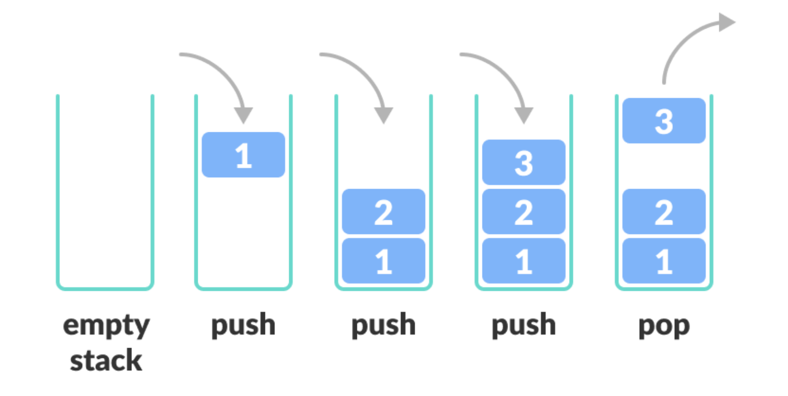
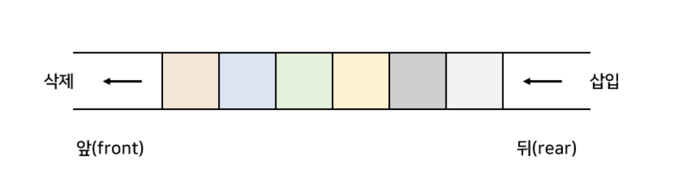

# 스택과 큐

## 스택

데이터를 임시 저장할 때 사용하는 자료구조

* LILO(Last In Last Out)

push

* 데이터를 넣는 작업 

pop

* 데이터를 꺼내는 작업

top

* 맨 윗 부분
* 가장 최근에 push 한 것

bottom

* 맨 뒷 부분
* 가장 push 한지 오래된 것

### 스택 구현하기
필요 변수 
* 스택 배열
* 스택 크기
* 스택 포인터

필요 함수
* 빈 스택 예외처리
* 가득 찬 스택 예외처리
* 스택 데이터 개수 반환 함수
* 스택 비어있는지 판단
* 스택 가득 차있는지 판단
* push 
* pop
* peek (top 데이터 확인)
* clear 모두 지우기
* find 검색
* count (스택에 있는 value의 개수 반환)
* __contaions__ (스택에 value있는지 판단)
* dump (스택 안에 모든 데이터를 바닥부터 꼭대기 순으로 출력)

collections.deque를 사용하면 쉽게 스택을 구현 할 수 있다.

## 큐

데이터를 임시 저장하는 자료구조

* FIFO(First In First Out)
* 마트 계산 줄, 은행 대기 순번 같은 상황

enqueue 
* 큐에 데이터 추가

dequeue
* 큐에 데이터를 꺼내느 작업

front

* 데이터를 꺼내는 쪽

rear

* 데이터를 넣는 쪽

### 큐 구현하기
필요 변수 
* 큐 배열 본체
* 큐 현재 데이터 개수
* 큐 맨 앞 원소
* 큐 끝 원소
* 큐 크기

필요 함수
* 빈 큐 예외처리
* 가득 찬 큐 예외처리
* 큐 비어있는지 판단
* 큐 가득 차있는지 판단
* enque 
* deque
* peek (맨 앞 데이터 확인)
* clear 모두 지우기
* find 검색
* count (큐에 있는 value의 개수 반환)
* __contaions__ (스택에 value있는지 판단)
* dump (큐 안에 모든 데이터를 front부터 rear 순으로 출력)

